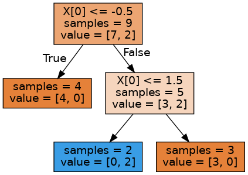

# ID3 vs CART

This repository is for testing out differences between ID3 and CART, particularly answering the question : Can "splitting attribute" appear many times in decision tree?

ID3
------------
For implementing ID3, the following repository was used: https://github.com/dassarthak18/decision-tree-id3

    git clone https://github.com/dassarthak18/decision-tree-id3.git
    cd decision-tree-id3
    python3 setup.py install

CART
------------
For implementing CART, we use Scikit-Learn's DecisionTreeClassfier.

RESULTS
------------
The dataset used was as follows:

| Input      | Output |
| ----------- | ----------- |
| -5      | 0       |
| -4      | 0       |
| -3      | 0       |
| -2      | 0       |
| -1      | 0       |
| 0      | 1       |
| 1      | 1       |
| 2      | 0       |
| 3      | 0       |
| 4      | 0       |
| 5      | 0       |
| 6      | 0       |

which represents the function f(x) = { 1 if x $\in$ [0,1] otherwise 0}.

ID3 does not allow splitting of attribute multiple times hence the tree obtained was as follows, hence incorrect:

  

CART allows splitting of attribute multiple times hence the tree obtained was as follows, which is closer to representing the function:

  

